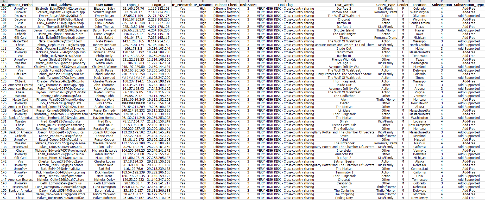
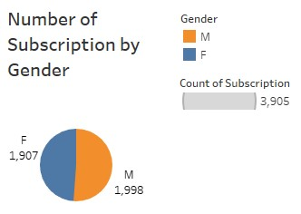
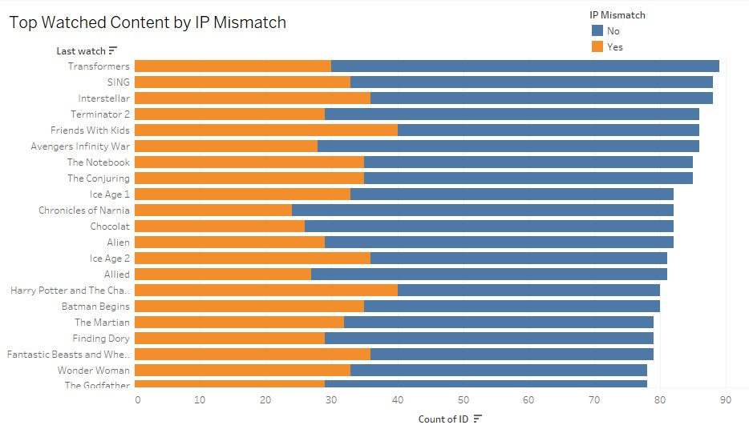
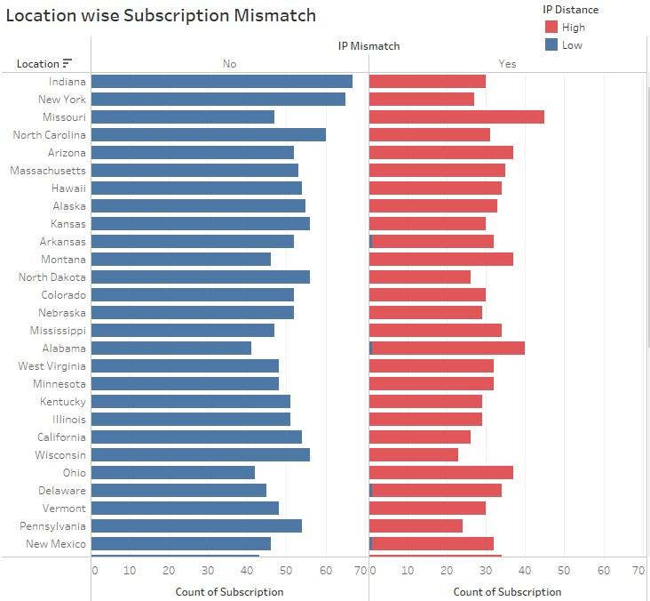
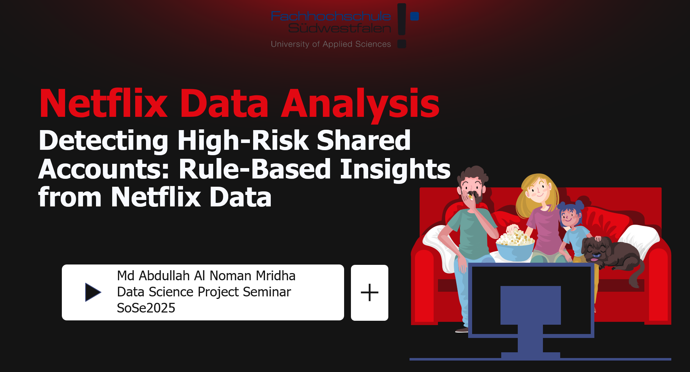
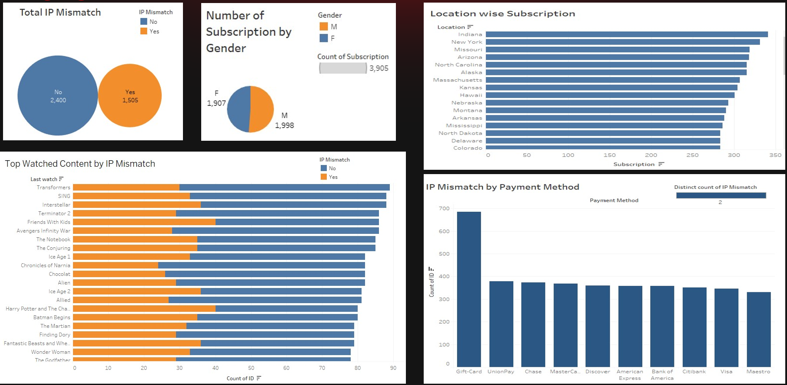
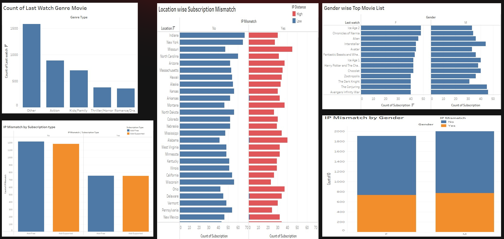

# 🎬 Netflix Data Visualization & Analysis

## 📌 Project Overview
This project focuses on analyzing and visualizing **Netflix content data** to uncover insights related to content distribution, genres, release trends, and regional patterns.

The goal of this project is to demonstrate the **end-to-end data analytics workflow** — from raw data exploration and preprocessing to visualization and business-oriented presentation.

---

## 🎯 Objectives
- Understand the structure and characteristics of Netflix content data
- Clean and preprocess raw Excel data for analysis
- Create meaningful visualizations using Tableau
- Present insights in a clear and business-friendly format

---

## 📂 Dataset Description
- **Source:** Netflix content dataset (academic use)
- **Format:** Excel (.xlsx)
- **Content Includes:**
  - Title type (Movie / TV Show)
  - Release year
  - Genre
  - Country
  - Duration
  - Rating

---

## 🛠️ Tools & Technologies Used

---

## 🔄 Project Workflow

### 1️⃣ Data Collection
- Imported raw Netflix dataset in Excel
- Reviewed structure, missing values, and inconsistencies

### 2️⃣ Data Preprocessing
- Cleaned and standardized data
- Filtered unnecessary columns
- Created derived columns for better analysis
- Stored cleaned data separately for transparency
## 📊 Dataset preprocessing overview

### 3️⃣ Data Visualization
- Connected processed Excel data to Tableau
- Designed interactive dashboards
- Focused on clarity and insight-driven visuals
  
    

### 4️⃣ Netflix Data Visualization Presentation
- Summarized findings in PowerPoint
- Created slides suitable for academic and business audiences

[Netflix_data_visualization.pptx](https://github.com/user-attachments/files/24689433/Netflix_data_visualization.pptx)

## 🖼️ Dashboard Preview

  

---

## 📊 Key Analysis Areas
- Distribution of Movies vs TV Shows
- Content trends over release years
- Genre popularity analysis
- Country-wise content availability

---

## 📈 Key Insights (Example)
- Netflix content has increased significantly after 2015
- Movies dominate the platform compared to TV shows
- Certain genres consistently appear across multiple regions

*(Exact insights may vary based on visualization)*

---

## 📂 Project Structure
netflix-data-visualization/  
│  
├── data/  
│ ├── raw/  
│ │ └── netflix_raw_data.xlsx  
│ └── processed/  
│ └── netflix_cleaned_data.xlsx  
│
├── dashboards/  
│ └── netflix_tableau_dashboard.png  
│
├── presentation/  
│ └── netflix_data_analysis_presentation.pptx  
│
└── README.md  

---

## 📎 Project Deliverables
- Raw and cleaned Excel datasets
- Tableau dashboard screenshots
- PowerPoint presentation

---

## 🎓 Academic Context
- **Degree:** M.Sc Informatics & Wirtschaft  
- **University:** Fachhochschule Südwestfalen  
- **Course:** Data Science Project Seminar – Driving Corporate Performance

---

## 🧩 How to View This Project

1. Open `data/raw/netflix_raw_data.xlsx` to see original dataset  
2. Open `data/processed/netflix_cleaned_data.xlsx` to see cleaned data  
3. View all dashboard images in the `dashboards/` folder  
4. Open the PowerPoint file in `presentation/` for full insights

---

## 📎 Conclusions

This analysis shows clear content trends on Netflix over time and provides a basis for strategic decisions on genre focus, regional content expansion, and platform growth patterns.

## 🤝 Contact
- 💼 LinkedIn: [Md. Abdullah Al Noman](https://www.linkedin.com/in/md-abdullah-al-noman-333aa4155)
- 💻 GitHub: https://github.com/nomanmridha

